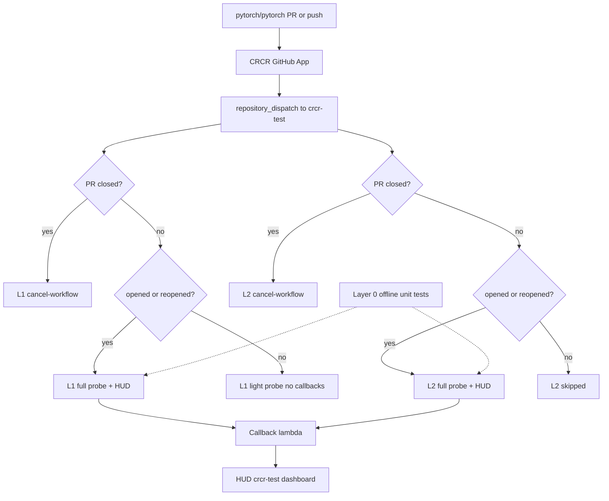

## Summary

Turns `pytorch/crcr-test` into a downstream CRCR test repo. This repo contains test workflows and validators that run on live `repository_dispatch` events from the relay.

On upstream PyTorch PR `opened`/`reopened`, workflows validate dispatch delivery, PyTorch checkout fidelity, and (for L2) relay callbacks. Health check outcomes are sent to HUD via the existing `completed` callback `test_results` field (each integration check maps to passed/failed/total).

On `synchronize` and `push`, L1 runs a **light probe** (payload + checkout only, no callbacks). L2 is skipped. This tiered model reduces relay HTTP 429 rate-limit hits ([#8](https://github.com/pytorch/crcr-test/issues/8)) while keeping dispatch coverage on high-volume events.



## Test layers overview

| | **L0 — Offline contract tests** | **L1 — Dispatch probe** | **L2 — Callback + HUD probe** |
|---|-------------------------------|-------------------------|-------------------------------|
| **Purpose** | Keep validators/fixtures correct | Prove relay dispatches a usable payload | Prove callbacks work and HUD gets metrics |
| **Workflow** | `crcr-unit-tests.yml` | `crcr-dispatch-receiver.yml` | `oot-l2-ci.yml` |
| **Trigger** | Push / PR to `crcr-test` | Live `repository_dispatch` (`pull_request` + `push`) | Live `repository_dispatch` (`pull_request`, `opened`/`reopened` only) |
| **Touches CRCR relay?** | No | Yes (receives dispatch) | Yes (dispatch + callbacks) |
| **Pushed to HUD?** | No | Yes on `opened`/`reopened` only | Yes on `opened`/`reopened` only |
| **When it runs** | On changes to test code | Every upstream PyTorch PR/push when relay fires | Upstream PR `opened`/`reopened` only |

## Event filtering (relay rate limits)

The callback Lambda enforces a per-repo sliding-window limit (~20/min in prod today; 60/min after [test-infra#8203](https://github.com/pytorch/test-infra/pull/8203) deploy). A full L1+L2 probe costs **4 callbacks**. `synchronize` is high volume and was tripping 429s when every event sent full callbacks.

| Event | L1 | L2 | Callbacks | HUD rows |
|-------|----|----|-----------|----------|
| `opened`, `reopened` | Full + HUD | Full + HUD | **4** | **2** |
| `synchronize` | Light (validate + checkout) | Skipped | **0** | **0** |
| `closed` | Cancel job | Cancel job | **0** | **0** |
| `push` | Light (validate + checkout) | N/A | **0** | **0** |

Light probe still validates dispatch payload, checks out PyTorch, verifies SHA, and uploads `health-report.json`. Callback coverage remains on low-volume `opened`/`reopened` where the callback code path is identical.

## Tests and checks by layer

### L0 — Offline (`crcr-unit-tests.yml`)

| # | Test | What it validates |
|---|------|-------------------|
| 1 | PR opened fixture | Dispatch payload shape for `opened` |
| 2 | PR synchronize fixture | Payload shape for `synchronize` |
| 3 | PR closed fixture | Payload shape for `closed` |
| 4 | Push / ciflow tag fixture | Payload shape for `push` |
| 5 | Reject missing `delivery_id` | Validator catches bad payload |
| 6 | Reject wrong upstream repo | Must be `pytorch/pytorch` |
| 7 | Reject invalid SHA | 40-char hex required |
| 8 | Callback `in_progress` shape | L2 wire format |
| 9 | Callback `completed` shape | L2 wire format + `conclusion` |
| 10 | Callback rejects missing `conclusion` | Completed must have conclusion |
| 11 | Checkout SHA mismatch detection | `validate_pytorch_checkout.py` logic |
| 12 | Health report to `test_results` mapping | passed/failed/total counts |
| 13 | Healthy / unhealthy report | `healthy`, `conclusion` fields |
| 14 | All fixtures through validator | End-to-end fixture sanity |

### L1 — Live dispatch probe (`crcr-dispatch-receiver.yml`)

| # | Check | Full (`opened`/`reopened`) | Light (`synchronize`/`push`) |
|---|-------|---------------------------|------------------------------|
| 1 | `validate_dispatch_payload` | Yes | Yes |
| 2 | `in_progress` callback | Yes | No |
| 3 | Checkout PyTorch @ dispatched SHA | Yes | Yes |
| 4 | `validate_pytorch_checkout` | Yes | Yes |
| 5 | Assert `delivery_id` | Yes | Yes |
| 6 | `completed` callback + HUD metrics | Yes | No |
| — | `cancel-workflow` (PR closed) | Cancel only | Cancel only |

### L2 — Live callback probe (`oot-l2-ci.yml`)

Runs only on `opened`/`reopened`.

| # | Check | What it validates |
|---|-------|-----------------|
| 1 | `validate_dispatch_payload` | Same L1 contract on live payload |
| 2 | `in_progress` callback | State DISPATCHED to IN_PROGRESS |
| 3 | Checkout PyTorch @ PR head SHA | PR ref fetchable |
| 4 | `validate_pytorch_checkout` | Checkout matches head SHA |
| 5 | Smoke checks | README, .github, Python (deterministic) |
| 6 | `write_health_report` + `completed` callback | `test_results` + `conclusion` to HUD |
| 7 | `completed_callback` in final report | Completed callback succeeded |
| — | `cancel-workflow` (PR closed) | L2 build skipped on `closed` |

## One upstream event — what runs?

| Upstream event | L0 | L1 | L2 | Callbacks | HUD rows |
|----------------|----|----|-----|-----------|----------|
| PR `opened` / `reopened` | — | `l1-critical` full | `l2-critical` | 4 | 2 |
| PR `synchronize` | — | `l1-light` | — | 0 | 0 |
| PR `closed` | — | `cancel-workflow` | `cancel-workflow` | 0 | 0 |
| Push / ciflow tag | — | `l1-light` | — | 0 | 0 |
| Push/PR to crcr-test | `crcr-unit-tests` | — | — | 0 | 0 |

## Shared components by layer

| Component | L0 | L1 | L2 |
|-----------|----|----|-----|
| `validate_dispatch_payload.py` | Fixtures | Live payload | Live payload |
| `validate_pytorch_checkout.py` | Unit test | Live checkout | Live checkout |
| `validate_callback_payload.py` | Unit test | — | — |
| `write_health_report.py` | Unit test | Live to HUD (full only) | Live to HUD |
| `cross-repo-ci-relay-callback` | — | Full probe only | Yes |

## Key changes

- **`tests/`** — payload validators, JSON fixtures, `write_health_report.py`, and 16 unit tests
- **`write_health_report.py`** — shared health reporter used by both L1 and L2 probes; aggregates step outcomes into `checks`, maps them to HUD `test_results`, and feeds the `completed` callback (separate report and HUD row per probe)
- **`crcr-dispatch-receiver.yml`** — L1 probe: full on `opened`/`reopened`, light on `synchronize`/`push`
- **`oot-l2-ci.yml`** — L2 probe: `opened`/`reopened` only; deterministic checks + callbacks
- **`crcr-unit-tests.yml`** — offline contract tests on push/PR to this repo
- **`scripts/`** — `run-local-tests.sh` and `trigger-test-dispatch.sh` for local/fork testing
- **README** — documents probe model, event filtering, triggers, and HUD metric mapping

CRCR health is measured when the relay dispatches; offline unit tests guard validator/fixture drift on merge.

## HUD health metrics

L1 and L2 full probes build a health report from step outcomes, then send it on the `completed` callback:

| Step outcome | HUD `test_results` |
|--------------|-------------------|
| `success` | `passed_tests` |
| `failure` / `cancelled` | `failed_tests` |
| `skipped` | `skipped_tests` |

`conclusion` is `success` only when all checks pass. Per-check names are in the `health-report.json` workflow artifact. Verify rows at https://hud.pytorch.org/crcr/pytorch/crcr-test

## Test plan

Pre-merge (offline):
```
cd crcr-test
./scripts/run-local-tests.sh
```

Pre-merge (CI):
- [ ] `crcr-unit-tests` workflow passes on this PR

Post-merge (live CRCR):
- [ ] Upstream PyTorch PR `opened` triggers `L1 Health` (full) and `L2 Health` workflows
- [ ] Upstream PyTorch PR `synchronize` triggers L1 light only (no L2, no callbacks)
- [ ] `completed` callback succeeds on `opened`/`reopened` (HTTP 2xx from relay)
- [ ] HUD row shows `passed_tests` / `failed_tests` / `total_tests` matching probe checks
- [ ] `health-report.json` artifact uploaded per run

Authored with an AI assistant.
